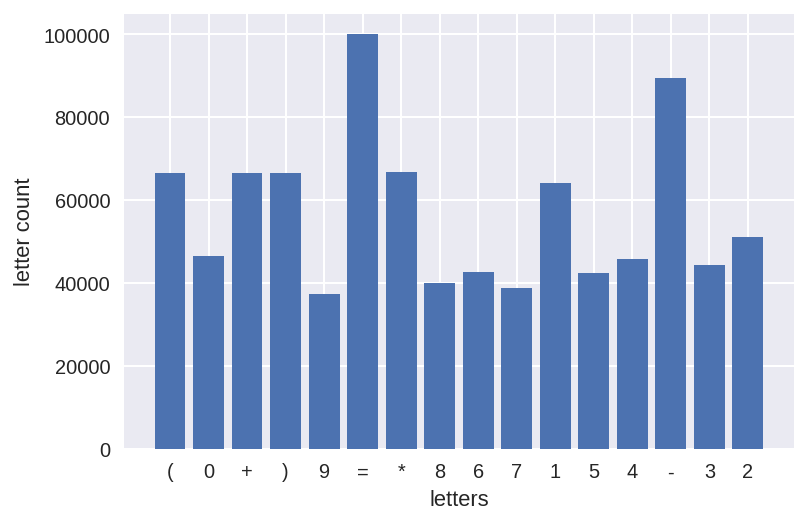

# 机器学习纳米学位
##毕业项目——算式识别
黄茹辉

2019年4月24日

[TOC]


## 1. 问题的定义

### 1.1 项目概述

　　字符是人们传递信息的媒介，诸如书籍、条形码、国旗等都是生活中常见的各式各样的字符。使用各种数字化手段，将这些信息保存起来可以为人们带来许多便利，比如将手动将纸质书录入到电子文档中可以使分享更加便捷。

　　在本项目中，需要从包含给定符号序列的图像数据中，训练出可以将这些图片数据所包含的字符转换成文本的模型。这一问题属于场景文字检测与识别中的序列识别问题，同时也是光学字符识别问题（Optical Character Recognition，OCR），其是计算机视觉领域的热点研究方向[1,2,3]。具体来说，本项目要解决的问题属于基于图像的字符序列识别（Image-based sequence recognition）范畴。区别于每次输入一个字符，并输出一个字符的识别任务，在序列识别中，输入数据是一段有序且变长的字符序列。在日常生活中，车牌号、门牌号、信用卡上的卡号、书本后面的ISBN号、广告牌上的电话号码等都属于字符序列。

　　由于智能手机和互联网的广泛普及，海量的信息都使用图像来存储，而如果能够在这些信息通过图像采集的同时，还能够实时转换成文本，那么就能够对这些信息更加有效地加以利用了。Google在3D地图数据采集过程中，对街道场景文字识别后标记于地图中可以提高地图的精度；在手机应用程序中部署诸如信用卡号识别的程序可以省去手动录入信息的繁琐步骤，从而提升应用的友好性。因此，研究OCR技术具有很高的应用价值。

### 1.2 问题陈述
　　项目中需要解决的问题是：从包含特定符号序列的图像中，准确输出该特定符号序列对应的文本。在这一问题中，给定的图像数据集是由机器生成的，且所有图像都包含有一串字符序列。在日常生活中，类似的符号序列包括门牌号、产品标签上的型号、银行卡号等，这些符号序列通常通过数字摄像头采集后，存储成数字化图像信息。它们与给定的数据集具有非常类似的特征：1）有序；2）由特定的符号组成；3）都是使用RGB三色通道组成的彩色图像。

　　给定的数据集包含两部分，图像和每张图像对应的真实文本，其中图像包含RGB三通道，精度为8bit。

　　项目将使用深度神经网络来解决这个问题。首先使用卷积神经网络（Convolutional Neural Network，CNN）对输入数据进行特征提取，然后将CNN生成的特征图输入到循环神经网络（Recurrent Neural Network，RNN）中进行序列识别。这样，图像的特征提取步骤和特征识别步骤就可以连接在一起，使神经网络在前向反馈和反向传播在一个端到端运行的过程中运行。最后借助损失函数，使CNN中的特征提取权重和RNN中的序列识别权重都能够在每次模型迭代中得到更新。

　　模型对于每张图片的输出都是一个文本，比如`3+2=5`，如果该文本和输入图像包含的符号序列相同，那么就说明模型对于这一输入具有正确的预测。如果模型在一批数据中，预测正常的数量越多，说明模型的预测效果越好。项目会对给定的数据集进行划分，一部分用于训练模型，一部分用于评估最终的模型性能。

### 1.3 评价指标
　　由于预测值是非数值型离散值，因此，可以使用准确率（Accuracy）来评估模型的性能，即预测正确的图片数所占样本总数的比例值：
$$
acc(f;D)=\frac{1}{m}\sum_{i=1}^{m}\mathbb{I}(f(\bold{x}_i)=y_i)
$$
其中，$\bold{x}_i$是输入数据，这里就是300x64个像素对应的数值（0~255）矩阵，$y_i$是真实值，$f(\bold{x})$是预测函数，$\mathbb{I}(\cdot)$是指示函数，当$\cdot$为真和假时，分别取1和0，$D$为整个输入的数据集。当$D$为训练集时，就表示训练集的准确率，当$D​$为验证集时，就表示验证集的准确率。


## 2. 分析
### 2.1 数据的探索
　　项目使用的给定数据集中一共包含10万张图片，分为两部分：图片和每张图片对应的真实文本。其中：

1. 每张图片包含$\{+, -, *,=,(,),0,1,2,3,4,5,6,7,8,9\}​$这16个符号中某些/全部符号的算式，且大小为300x64像素，每个像素包含RGB三通道，每个通道8bit，即值范围是0～255样例如下图所示，样例如图所示；

     

2. 与输入数据对应的文本，例如上图对应的文本是：`(0+0)+9=9`这一长度为10的字符序列，其中标签长度最大值为11。

　　通过查看发现，每张图中的字符都以相同的颜色呈现，字体形态上类似，线条粗细差异较大，都是肉眼可以清楚辨别的字符，同时输入数据包含有大量随机分布的点状噪声。

　　按照标签文本的长度对数据进行可视化，可以发现数据的分布非常不均匀，标签长度不一致的数据量差异较大。长度为10的标签几乎是长度为11的标签的10倍。在划分训练集和验证集的时候，需要考虑按照标签长度分层划分数据集。


文本中字符的比例分布情况：



多数字符的出现比例一致，其中`=`字符出现的次数远高于其它字符，原因是所有有效等式都包含这一字符，而`(`、`)`、`-`、`+`、`*`这些字符是构成运算的必要符号，通常这些运算符两侧都会有数字，所以会比数字出现的频率更高，除了`-`符号之外，其它的运算符号出现次数差异不大。总体来说，字符在出现比率上的分布是比较均衡的。

另外，考虑到数据集中统一输入中字符颜色都一致，图像的颜色差异很大，彩色通道对特征提取没有帮助（因为颜色信息本身与标签没有实质关系），因此将考虑将数据灰度化后再输入到模型。

### 2.2算法和技术
#### 2.2.1 算法

##### 深度神经网络

　　人工神经网络（Artificial Neural Network，ANN），简称神经网络（Neural Network，NN）是一种模仿生物神经网络的结构和功能的数学模型或计算模型，用于对函数进行估计或近似。神经网络由大量的人工神经元联结进行计算。大多数情况下人工神经网络能在外界信息的基础上改变内部结构，是一种自适应系统，通俗的讲就是具备学习功能。下图是一种全连接型神经网络，其主要包括两部分，在网络训练的过程中，主要包括前向反馈和反向传播两个步骤。其过程如图所示：


1. 前向反馈使用前一层的神经元输出值和对应的权重矩阵计算得到当前层的神经元输入值，计算方式为：
   $$
   X_{i}^{(l)}=W_{i}^{(l)}*Z_{j}^{(l-1)}, Z_{j}^{(l-1)}=f(X_j^{(l-1)})
   $$
   其中，$X_{i}^{(l)}$和$Z_{i}^{(l)}$分别是第$l$层第$i$个神经元的输入值和输出值，$W_{i}^{(l)}$是第$l-1$层对第$l$层第$i$个神经元的权重值，$f(x)$是激活函数，常用的比如$sigmoid$函数、$ReLU​$函数。

2. 在反向传播中，使用损失函数对权重变量的偏导数计算出权重变量在每次迭代过程中的增量。
   $$
   \Delta(w_{i,j}^{(l)})=\frac{\partial{Loss}}{\partial{_{i,j}^{(l)}}}, w_{i,j}^{(l)}:=w_{i,j}^{(l)}+\eta\Delta(w_{i,j}^{(l)})
   $$
   其中$w_{i,j}^{(l)}$是第$l-1$层第$i$个单元对第$l$层第$j$个单元的权重，$\eta$为学习速率，是用于调整更新权重幅度使得$Loss$可以更容易地逼近最小值的超参数。

　　神经网络在训练的迭代过程中，将以最小化损失函数$Loss$为目标，最终使$Loss$达到一个全局最小值。

##### 卷积神经网络

　　全连接型神经网络前后两层网络中的每个神经元之间都是相互连接的，而且两两神经元之间的权重都不一样，即同一层网络中的神经元之间是完全独立的，相互之间没有关系。卷积神经网络引入了一种不一样的连接方式，如图所示，对于一个三通道的RGB图像，首层网络即为三个二维的节点，第二层网络将由三个二维的*Filter*矩阵与首层节点运算得到，这三个*Filter*矩阵就相当于全连接神经网络中的权重矩阵。


下一层的单元由下式计算得到：
$$
S_0=f(\sum_{i=0}^{9}w_ix_i)
$$
其中，$f(x)$是激活函数。对于同一层的同一个节点，它们将共享*Filter*的权重。这种连接方式主要引入了两个特性：

1. 感受野（Receptive field）。每个*Filter*相当于一个检测输入信息特征的感知领域，在神经网络训练过程中，*Filter*可以逐渐检测出输入信息在二维空间上的特征，例如发现角点、纵向直线等，而*Filter*的尺寸就决定了这一感受野的大小；
2. 每个*Filter*从输入图的首部滑动到末尾，生成下一层特征图，这种神经元之间局部连接的方式，使权重变量大量减少。

##### 循环神经网络

　　全连接型和卷积神经网络都不能够处理在时间序列上相关的输入，循环神经网络通过引入时间序列结构来解决这个问题。如图所示，隐藏单元的值由上一时间隙的值和输入共同确定。


在*RNN*中，输入被编码成固定长度的时间序列$\overrightarrow{x}=\{\overrightarrow{x_t},\cdots,\overrightarrow{x_1}\}$，例如，*CNN*的输出转换成二维的特征图后，每一列就相当于一个时间序列。隐藏层的值$h_t=f(\overrightarrow{x}_t, \overrightarrow{h}_{t-1})$随着时间不断更新，在RNN的前馈和反向传播过程中，$\overrightarrow{h}_{t-1}$对于$\overrightarrow{h}_t$的权重将学习到更早之前的隐藏层对于当前时刻隐藏层的影响程度，从而体现时间相关性。

　　单纯的*RNN*因为无法处理随着递归，权重指数级爆炸或梯度消失的问题，而难以捕捉长期时间关联，结合长段时间记忆（*LSTM*）可以解决这个问题。

##### CTC损失函数

　　*RNN*的输出是一组序列，每个序列对应某个字符的*Softmax*输出，通常需要将这一序列中每个值与原始图像中的每个字符进行对其，这样就没办法形成从输入到*CNN*、*RNN*，再到损失函数的端到端模型。CTC（Connectionist Temporal Classification）算法可以解决这一问题，*CTC*支持任意长度的序列作为输入，并且不需要与原始的每个字符进行对其操作。*CTC*引入一个额外的空字符，对于给定输入（一组包含每个字符的*Softmax*输出），*CTC*计算该输入序列长度下，对应标签的所有潜在组合，再计算输出所有潜在组合的联合概率，这些潜在组合的联合概率之和就是对应输入和标签条件下的$Loss$。
$$
p(Y|X)=\sum_{\mathcal{A}\in\mathcal{A}_{X,Y}}\prod_{t=1}^{T}p_t(a_t|X), Loss(D)=\sum_{(X,Y)\in D}-\log{p(Y|X)}
$$
其中，$X,Y$分别对应输入数据和标签，$T$是时间序列长度，$p_t(a_t|X)$是给定输入$X$下，序列内索引为$t$的字符为$a_t$的概率，$\mathcal{A_{X,Y}}​$是给的标签下所有可能的字符组合。

#### 2.2.2 技术

　　项目使用如下工具开发与运行：

1. *Keras*，开源的机器学习与深度学习工具，提供简洁易用的API，项目使用这一工具的API搭建所有模型；
2. *Tensorflow*，开源的机器学习框架，包含了大量机器学习工具，支持连接到GPU、TPU运行模型，项目的*Keras*使用此框架作为运行后端；
3. *OpenCV*，开源的计算机视觉工具库，项目中主要用于读取图像和预处理。

### 2.3 基准模型
　　Gordo et al. [6]使用一种基于有监督的Mid-level特征的识别算法，其在有词汇表的情况下，在IIIT5k数据集上的准确率达到93.3%。Jaderberg et al.[4]使用5层*CNN*和3层全连接神经网络构建的识别算法在IC03数据集上准确率达到98.7%。Shi et al.[5]提出一种使用*CNN*和*RNN*结合的端到端识别算法，它在IC03数据集上达到了98.7%的准确率，同时在IIIT5k上达到了97.6%的准确率。本项目的目标是在测试集上至少达到99%的识别准确率。


## 3. 方法
### 3.1 数据预处理
　　项目将使用两种方法创建与训练模型：1）自定义模型；2）使用迁移学习，载入预训练的*VGG19*模型进行训练。输入数据是RGB三个通道的图像，对于自定义模型，在数据生成器中将数据转换成灰度图，而迁移学习的输入图通道不变。

```python
# 将输入图转换成灰度图
cv2.imread(self.img_paths[img_path_idx], cv2.IMREAD_GRAYSCALE)
```

归一化和中心化数据，使神经网络在训练过程中表现更佳：

```python
img = img / 255 * 2 - 1
```

### 3.2 执行过程

　　*Google Colab*是一个免费的机器学习环境，其环境信息：

- Tesla K80 GPU，2496 CUDA cores，12GB(11.439GB Usable) GDDR5  VRAM；
- 单核双线程Xeon处理器，主频2.3GHz
- 内存12.6GB；
- 硬盘320GB；

　　项目所有工程的结果都使用*Google Colab*的环境运行得到。

项目使用基于*VGG19*的迁移学习模型和自定义模型两种方法搭建模型，两种方法只在模型结构上有所不同。主要步骤：

1. 按照不同的标签长度，采用分层抽样的方法将数据集分成训练集、验证集、测试集，比例为：8:1:1；

   

2. 定义数据生成器。由于GPU内存限制，不能够一次性加载所有数据，所以需要能够部分读入的数据生成器。

   - 数据生成器使用标签和文件路径作为输入，每次模型需要一批数据时，就按照文件名从磁盘读取一批图像数据，在此过程中，同时执行3.1中的数据预处理过程；

   - 在构造的每批数据中，输入包括四部分，输出仅作为参数占位符

     ```python
     inputs = {
     	'inputs': the_inputs,
       'the_labels': y_true,
       'input_length': input_length,
       'label_length': label_length
     }
     
     outputs = np.zeros(shape=(self.batch_size, 1))	# 仅作为参数占位符，并无实际用途
     ```

     其中`the_inputs`是图像数据，`the_labels`、`input_length`和`label_length`作为*CTC*损失函数的计算输入；

   - 在训练过程中，每个*Epoch*会将数据随机化一次。

3. 将标签映射成数字序列。

   ```python
   characters = '-+*()=0123456789'	# 所有可能的字符
   num_of_chars = len(characters) + 1	# 加上一个空白字符，用于CTC
   
   def text_to_index(text):
       return [characters_list.index(char) for char in text]
   
   def index_to_text(index):
       return [characters_list[i] for i in index]
   ```

4. 定义*CTC*解码函数，用于计算模型准确率。

   ```python
   def decode_ctc(y_pred):	# y_pred是输出字符序列对应的Softmax向量
       pred_label_index_list = list(np.argmax(y_pred, axis=2))
       label_strs = []
       for pred_label_indexes in pred_label_index_list:
         	# 移除连续重复的字符
           char_indexes = remove_consecutive_duplicate(list(pred_label_indexes))
           label_strs.append(''.join(index_to_text(char_indexes)))
       return list(map(lambda s: s.replace(' ', ''), label_strs))
   ```

5. 定义模型准确率的计算方法。计算方式通过继承*Keras*模型训练过程中每个迭代Epoch的回调类`Callback`来实现。在该类的方法`on_epoch_end`方法中，使用验证集和模型的预测输出计算出验证集的准确率。

6. 定义*CTC*损失函数。由于模型的输出是`tensor`，需要使用*Tensorflow*内置的函数来计算*CTC*损失。

   ```python
   def ctc_lambda_func(args):
       y_pred, labels, input_length, label_length = args
       return backend.ctc_batch_cost(labels, y_pred, input_length, label_length)
   ```

7. 由于需要在训练过程中将非`tensor`类型的值传入，用于计算*CTC*损失，因此模型需要有多个输入，另外计算模型的准确率需要使用计算损失损失函数之前的`Softmax`输出，因此，模型一共有两个输出。在*Keras*的模型定义中，定义多个输出和输入，需要使用具体的名字明确定义，如步骤2所示。

8. 定义模型结构。

   

   - `labels`是将真实标签转换成索引后的向量，`label length`设置成比数据集中最大标签长度更大的值，`input length`是*RNN*层输出的时间序列的长度，`Image data`是原始图像/灰度图数据；

   - 在*Map CNN to RNN*模块中，由于输入数据是`(64, 300) `，那*CNN*的输出会是类似`(4, 18, 2058)`这样的维度，第一维度比第二位度要大，在输入到*RNN*之前，需要将其转换成以`18`这一维度上的时间序列。此时如果直接使用`Reshape`层来转换会导致特征图的排列发生错乱，导致网络在训练过程中无法聚合，应使用`Permute`对维度进行转换：

     ```pytho
     inner = Permute((2, 1, 3))(inner)
     ```

     在维度转换后，还需要将其转换成二维的特征图，表示成在时间序列上的特征，使用`TimeDistribbuted`层可以实现：

     ```python
     inner = TimeDistributed(Flatten())(inner)
     ```

     这里面，必须使用`TimeDistributed`对输入序列进行时间序列这一维度上的`Flatten`操作，使其对于后面*RNN*的输入是以时间序列的形式进行的；

   - *Softmax*的输出包含了一个时间序列上对每个字符的预测向量，需要根据*CTC*的编码规则进行解码，这是使用了步骤4中的`decode_ctc`函数；

   - 考虑到当前字符与前后字符都会有相关性，*RNN*模块使用两层双向的*LSTM*。

#### 3.2.1 使用迁移学习模型

　　这里使用基于*VGG19*的模型结构，丢弃最后一层的Pooling层，载入*imagenet*的预训练权重，初步训练中，只开放最后五层的卷积层为可训练的：

```python
vgg = applications.VGG19(input_shape=(img_width, img_height, img_channel), weights="imagenet",
                                       include_top=False)
for l in vgg.layers[:-5]:
	l.trainable = False
vgg.layers[0].name = 'inputs'
layer_dict = dict([(layer.name, layer) for layer in vgg.layers])
inner = layer_dict['block5_conv4'].output
```

#### 3.2.2 使用自定义模型

　　初始的自定义模型：


### 3.3 完善

#### 3.3.1 迁移学习

　　模型使用`adam`优化器，学习速率使用默认的`0.001`：

```python
Adam(lr=0.001, beta_1=0.9, beta_2=0.999, epsilon=None, decay=0.0, amsgrad=False)
```

开放最后五层作为训练层可以达到*86.55%*，左侧的是模型在每个*Epoch*结束后的测试集准确率：


可以看到，*Loss*在开始收敛得非常快，到后面呈现缓慢下降的趋势，但是整体上没有大幅度的下降了。原因可能是开放的可训练层对于当前数据集的拟合程度还不够。在此基础上，开放所有层为可训练：


如图所示，模型在快速收敛后，最终的测试集上的准确率有了很大提升，达到*99.33%*。

#### 3.3.2 自定义模型

1. 初始模型设置参数如下：

   ```python
   batch_size = 64	# train
   valid_batch_size = 16	# valid
   Adam(lr=0.001, beta_1=0.9, beta_2=0.999, epsilon=None, decay=0.0, amsgrad=False)
   ```

   

   上图中左侧为模型都是在当前*Loss*模型下测试集的准确率（最开始程序在验证集上都使用当前*Loss*最小的模型计算准确率，后来发现这是个bug），模型在训练过程中，验证集的*Loss*波动幅度非常大，但最终使用*Loss*最小的模型可以达到*97.03%*的准确率。

2. 尝试使用*SGD*优化器，可以有效抑制模型*Loss*抖动的问题，但是收敛速度较慢。尝试移除前面的*Batch Normalization*层，只保留最后一层的*Batch Normalization*层，并减小训练速率到0.0001，模型在训练工程中，*Loss*的浮动幅度减小很多，呈现较平稳下降的趋势。但是测试集准确率*95.90%*，反而下降了一些，可能原因学习速率过低，进入了局部最小值，且模型拟合程度还不够，对某些未见数据偏差较大。

   

3. 模型在验证时时间较长，发现GPU内存仍然充裕，可以增大`valid_batch_size`到100，减小训练时间；

4. 调整模型，整体上增加复杂度，调整学习速率到`0.0005`，最终*CNN*部分的模型：

   

   该模型在前几个*Epoch*就快速收敛了，其最终在测试集上的准确率达到了*99.47%*。


## 4. 结果
### 4.1 模型的评价与验证
1. 基于迁移学习的模型与最终的自定义模型在训练时间上相差无几，迁移学习的学习曲线呈现出更佳稳定的趋势，但在评估指标上，自定义模型更优，并且在模型复杂度上，自定义模型也占上风，因此选择自定义模型作为最终模型。在自定义模型的迭代过程中，模型复杂度由简单到复杂，模型的准确率也逐步提高，而从最终模型的学习曲线来看，模型没有过拟合，这与预期的结果是一致的；
2. 下图是模型在测试数据集上的表现，其中前两张是手写体，后面七张是在已有测试集上选取并手动随机涂抹之后的数据。可以看到，在手写体上，模型的预测完全错误，这是数据集差异引入的，手写体和给定数据集的特征差异非常明显，对于这种数据，模型无法预测。但是对于给定数据集上较为轻微的更改，模型仍然能够预测正确，如样例4、5、9，对于涂抹较严重的就无法预测准确，如样例3、6、7、8。


3. 由测试集上的表现和上面的分析可以看出，模型得出的结果在特定数据集上是可信的。

### 4.2 合理性分析
　　由最终模型的学习曲线和在测试集上的评估可以看到，最终模型达到了*99.47%*的准确率，比基准模型高出*0.47%*个百分点。


模型对于给定的数据集表现非常好，但对于与给定数据集特征差异较大的数据集，表现很差，这种差异是模型在识别数据集有效数据（即字符的特征）上的差异导致的，而不是噪声差异导致的，这是符合预期的。因为所得模型本身就是建立在给定数据所包含的特征之上的。因此，本项目所得到的最终模型可以有效解决给定的问题。


## 5. 项目结论
### 5.1 结果可视化
1. 数据的不均衡性：

   - 所有数据的字符在图像中的位置都偏向左方：

     

   - 标签长度分布不均匀：

     

   对于上面的第二个问题，项目使用分层采样的方式对数据划分，在一定程度上规避了数据分布不均造成的影响。

2. 项目的基准是获得准确率至少达到*99%*的模型，这里对比了基于*VGG19*的迁移学习模型和自定义模型两种方式训练得到的模型，相比迁移学习模型，自定义的模型收敛速度更快，准确率更高，学习曲线更佳平滑。

   | CNN模块                 |                           学习曲线                           |  Acc   | Time |
   | ----------------------- | :----------------------------------------------------------: | :----: | ---- |
   | 基于VGG19的迁移学习模型 |      | 99.33% | 12h  |
   | 自定义模型              |  | 99.47% | 11h  |

### 5.2 对项目的思考
　　本项目结合给定的数据集和问题出发，分析出该问题属于一种基于图像的序列识别问题，也是光学字符识别问题。既然是与图像相关的识别问题，那么使用*CNN*来检测图像的特征就显得理所当然了。又考虑到需要识别的对象是一组序列，而不是单个字符，结合*RNN*擅长检测出输入数据在时间序列上相关性的特点，可以将*CNN*的输出再输入到*RNN*。这是整个模型的基础框架部分。

　　为了能让整个通道可以成功运行，使神经网络在输入数据的驱动下训练出理想的权重，就需要使用合理的损失函数，使反向传播可以起作用。*CTC*的思想解决了字符与时间序列需要对其才能计算损失的问题，使构建端到端的训练模型成为可能。

　　在整个程序实现的过程中需要格外注意几个问题：

- *CNN*与*RNN*衔接的部分需要格外注意，`Reshape`层会改变数据原本维度上的排列方式，在这里，使用`Reshape`会使模型在训练过程中会完全不起作用，*Loss*一直在5以上震荡；
- *Keras*对于自定义Metrics函数的功能不是很完善，文档也不够详细，最终代码中所有训练集的准确率都没有画出来就是因为没办法实现这种自定义的Accuracy Metric。当然，如果使用像验证集一样的方法，在Callback中实现也可以，但是验证集非常大，会使训练周期大幅增长；
- 使用分层采样的方式划分数据集和合适的学习速率都可以有效改善学习曲线震荡的问题；
- 在数据量大、内存资源有限时，使用数据生成器非常有效，需要注意输入&输出与模型中的命名对应关系；
- 在刚开始训练模型时，先使用简单的模型训练，把参数都设置成默认值或者经验证，可视化学习曲线后，观察学习曲线的状态，可以有效得出当前模型是否在正常工作的结论。

通过对比基于迁移学习所得的模型和自定义模型的性能，发现迁移学习在解决这一问题中并没有优势，原因可能是：一方面，这个问题所使用的数据集太小；另一方面，给定的数据集在随机特征量上太少，现实生活中的数据集往往具有非常多的随机量特征。


### 5.3 需要作出的改进
　　在模型改善方面：

- 观察数据发现，当前的图像数据中，所有的标签在图像中都是靠左边偏的，在真实的数据中，标签位置往往都是随机的，因此这种数据将会对模型的泛化性能造成严重影响。可以考虑使用现有的数据，首先识别出标签在图像中的位置，然后针对位置这一特性生成增强的数据，重新训练模型。如4.1所做的预测结果，在测试数据右侧区域的涂抹相比在左侧区域涂抹，更容易造成模型预测错误；
- 在*RNN*模块中，可能使用其他类型的单元能够得到更好的效果，如*GRU*；

　　在工程调试方面：

- 浏览器上的Jupyter notebook非常不便于代码调试，且编写代码容易出错，更有效的方式是使用IDE编写/调试工程；

----------
### 参考文献

[1] Zhu, Yingying, Cong Yao, and Xiang Bai. "Scene text detection and recognition: Recent advances and future trends." *Frontiers of Computer Science* 10.1 (2016): 19-36.

[2] Sigai已认证的官方帐号 . “自然场景文本检测识别技术综述.” *知乎专栏*, 24 Feb. 2019, zhuanlan.zhihu.com/p/38655369.

[3] “Optical Character Recognition.” *Wikipedia*, 21 Feb. 2019, en.wikipedia.org/wiki/Optical_character_recognition.

[4] Jaderberg, Max, et al. "Reading text in the wild with convolutional neural networks." *International Journal of Computer Vision* 116.1 (2016): 1-20.

[5] Shi, Baoguang, Xiang Bai, and Cong Yao. "An end-to-end trainable neural network for image-based sequence recognition and its application to scene text recognition." *IEEE transactions on pattern analysis and machine intelligence*39.11 (2017): 2298-2304.

[6] Soldevila, Albert Gordo. "Supervised mid-level features for word image representation." U.S. Patent No. 9,245,205. 26 Jan. 2016.

[7] Hannun, Awni. “Sequence Modeling with CTC.” *Distill*, 21 Nov. 2018, distill.pub/2017/ctc/.

[8] *CS231n Convolutional Neural Networks for Visual Recognition*, cs231n.github.io/convolutional-networks/.

[9] “Understanding LSTM Networks.” *Understanding LSTM Networks -- Colah's Blog*, colah.github.io/posts/2015-08-Understanding-LSTMs/.