# 机器学习纳米学位
## 开题报告
黄茹辉  
2019年2月24日

### 项目背景
　　基于图像的序列识别（Image-based sequence recognition），是计算机视觉处理任务——文本识别中的一项子研究领域。区别于每次输入一个字符，并输出一个字符的识别任务，在序列识别中，输入数据是一段有序且变长的字符序列。在日常生活中，车牌号、门牌号、信用卡上的卡号、书本后面的ISBN号、广告牌上的电话号码等都属于字符序列。由于智能手机和互联网的广泛普及，这些字符序列能够被以图像的形式电子化存储，但只有当这些序列被转换成文本的时候，才能发挥其更大的作用（例如更加便于信息输入、能获得更加清晰的打印质量以及更小的存储空间）。

针对这一问题，有研究者尝试首先对图像中的单个字符进行分割，然后使用深度卷积神经网络进行每个字符的识别，这种方法需要有一个准确性高的字符分割器，以便将字符序列准确分割；也有研究者尝试将

### 问题描述
　　项目中需要解决的问题是：从包含特定符号序列的图像中，准确输出该特定符号序列对应的若干个文本序列。这些包含符号序列的图像可以使用数字摄像头（比如手机）在各种生活场所中采集，例如门牌号、产品标签上的型号、路标等，即问题容易重现。数字图片通常使用RGB三个通道且精度确定（例如0～255）的数值来表示，将这些数值输入到预测算法后，预测算法的输出结果只有两种：与真实符号序列匹配或者不匹配，即该问题可以被衡量。通过对批量的输入数据作出预测，可以得到总体预测的准确度、错误率等统计信息，即问题可以被量化。

### 数据集或输入
　　项目基于给定的数据集进行研究，其包含两部分：

- 输入数据：10万张图片，每张图片包含$\{+, -, *,=,(,),0,1,2,3,4,5,6,7,8,9\}​$这16个符号中某些/全部符号的算式，且大小为300x64，每个像素包含RGB三通道，每个通道8bit，即值范围是0～255样例如下图所示，样例图片如下；

  

- 与输入数据对应的标签，例如上图对应的标签是：`(0+0)+9=9`。

将输入图的300x64像素值转换成矩阵输入到预测算法，该输入图对应的标签以字符串形式读取，通过判断预测算法的输出是否与标签匹配作为是否预测正确的标准，例如上图中，当预测算法输出`(0+0)+9=9`时，那么预测算法预测正确，否则判断为错误。

### 解决方案描述
　　项目使用循环卷积神经网络（Convolutional Recurrent Neural Network，CRNN）模型进行训练。CRNN将图像作为输入，使用第一部分的卷积神经网络（CNN）从图像中提取出特征向量，然后将特征向量输入到第第二部分的循环神经网络（RNN），RNN可以提取出连续输入的特征在时间前后的关系，并输出成字符序列：

$s_1, s_2, \cdots,s_n,s_i \in \{+, -, *,=,(,),0,1,2,3,4,5,6,7,8,9\}​$，最后使用CTC（Connectionist Temporal Classification）编码和解码成最终的预测结果。

### 基准模型
_(approximately 1-2 paragraphs)_

　　在这一段落里面，需要描述目前这一研究领域的基准，就是已经达到了怎样的准确率。

In this section, provide the details for a benchmark model or result that relates to the domain, problem statement, and intended solution. Ideally, the benchmark model or result contextualizes existing methods or known information in the domain and problem given, which could then be objectively compared to the solution. Describe how the benchmark model or result is measurable (can be measured by some metric and clearly observed) with thorough detail.

### 评估指标
　　由于预测值是非数值型离散值，因此，可以使用准确率（Accuracy）来评估模型的性能，即预测正确的图片数所占样本总数的比例值：
$$
acc(f;D)=\frac{1}{m}\sum_{i=1}^{m}\mathbb{I}(f(\bold{x}_i)=y_i)
$$
其中，$\bold{x}_i​$是输入数据，这里就是300x64个像素对应的数值（0~255），$y_i​$是真实值，$f(\bold{x})​$是预测函数，$\mathbb{I}(\cdot)​$是指示函数，当$\cdot​$为真和假时，分别取1和0，$D​$为整个输入的数据集。当$D​$为训练集时，就表示训练集的准确率，当$D​$为验证集时，就表示验证集的准确率。

### 项目设计
　　根据前面的步骤，项目的总体设计方案如下：

1. 数据预处理。

   

   由于所有输入数据具有相同的尺寸，因此不再需要做尺寸变换。但针对当前的项目，输入不需要三个颜色通道，将图像灰度化后还可以减少计算量；归一化使数据以0为中心，使神经网络更好地工作；

2. 划分数据集，将数据集按照$4:1$划分为训练集和测试集，再将训练集按照$4:1$划分为实际训练集和验证集；

3. 使用Keras、TensorFlow、OpenCV等工具搭建卷积循环神经网络，其主要结构如下图所示；

   

   1. 卷积神经网络将输入通过多层卷积层、池化层、Normalization层后，将输入转化成特征向量图；
   2. 特征向量图前后列之间的关系即为特征向量在时间上的先后关系，循环神经网络使用LSTM单元构成；
   3. 循环神经网络的输出是经过Softmax之后的概率值，对应于每个特征向量预测为所有可能字符的概率向量，

4. 选定合适的学习速率、Batch GD的Batch大小、Early stop的界限，并可视化学习曲线，在训练模型过程中，根据学习曲线选定最佳训练轮数（Epoch）；

5. 在选定最佳训练轮数值后，将训练集和验证集合并，重新训练模型，得到最终的模型；

6. 使用训练好的模型对测试集进行预测，评估其准确率。

-----------

### 参考文献

